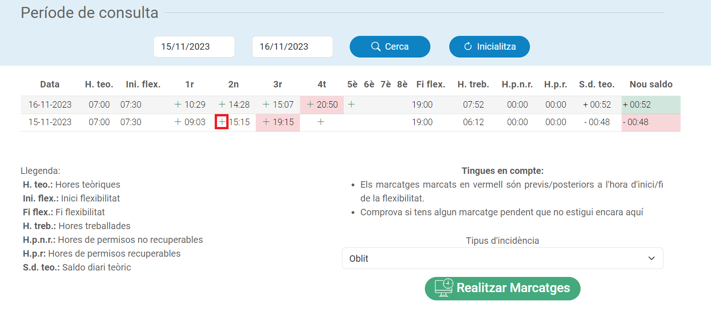
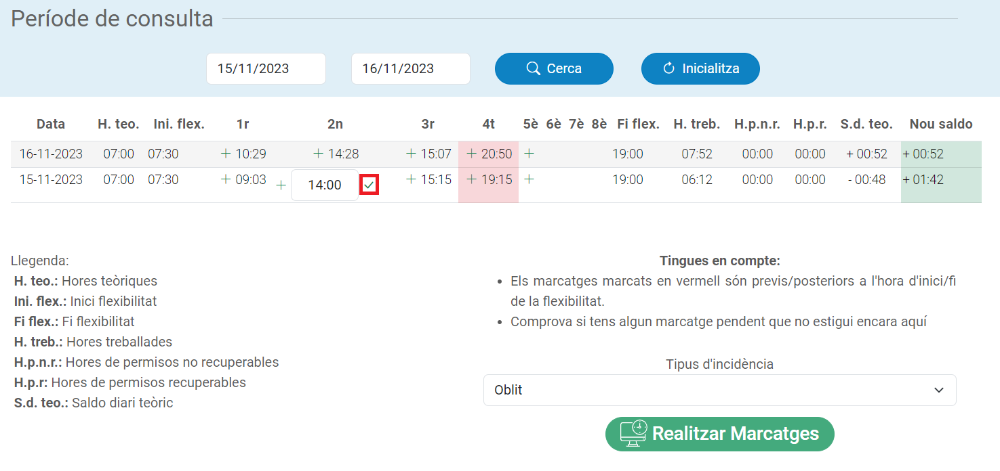

# Eines pel Tempus UPC

Aquest repositori conté dues eines per ajudar a gestionar els marcatges pendents del Tempus:  
- Un script que modifica la vista de saldo mensual al navegador per ajudar-te a sol·licitar els marcatges que et falten fàcilment.
- Un script de python que permet sol·licitar múltiples marcatges a la vegada.

A les següents seccions s'explica com utilitzar ambdues eines.  
Per a qualsevol problema o proposta, creeu un issue [aquí](https://github.com/Diviloper/tempus_clocker/issues).

## Eina pel navegador

### Funcionalitats

Aquesta eina permet el següent des de la vista de saldo per dies o saldo mensual:

- Realitzar nous marcatges
- Veure el nou saldo amb els marcatges escollits
- Veure el rang de flexibilitat
- Veure els marcatges fora del rang de flexibilitat

A més, també elimina la imatge que no aporta gaire :).

Pots veure els elements que s'afegeixen a la següent imatge comparativa:


### Instal·lació

Per utilitzar-la, crea manualment un nou element a la barra d'adreces d'interès del teu navegador i afegeix el següent codi al camp URL (pots posar el que tu vulguis com a nom):
```javascript
javascript: (function() {let script = document.createElement('script');script.src = "https://github.com/Diviloper/tempus_clocker/releases/download/latest/month_manager.js";document.head.appendChild(script);})();
```
Pots crear un element ràpidament arrossegant el següent enllaç a la barra d'adreces: [Canvia'm](Canvia'm). Un cop allà, simplement fes clic dret a sobre i selecciona editar per acualitzar el nom i la URL (on hi has de posar el codi que tens a sobre).  

Aquest codi simplement afegeix el fitxer [`month_manager.js`](./month_manager.js) com a script per a que s'executi. Pots entrar al fitxer per veure exactament tot el codi que s'executarà.

### Ús

Un cop tinguis el botó a la barra, simplement fes-hi clic des de la pàgina de [**saldo per dies**](https://tempus.upc.edu/RLG/saldoMarcatgesIndividual/list) o la de [**saldo mensual**](https://tempus.upc.edu/RLG/saldoMensual/list) (un cop seleccionat el mes).

La taula de marcatges s'hauria d'haver ampliat amb columnes extres, colors i botons, tal i com es veu a la següent imatge:



A continuació, utilitza els botons (+) per afegir els marcatges necessaris. Un cop afegits tots, prem el botó de "Realitzar marcatges".


Després d'acceptar l'avís que et sortirà, es procedirà a fer els marcatges un a un. Es deixarà un marge d'un segon entre marcatges. Les icones al costat dels nous marcatges t'indicaran l'estat actual (groc en espera, blau en procés, verd finalitzat i vermell en error).



Un cop tots finalitzats, comprova que no hi hagi hagut cap error i que els marcatges s'hagin fet correctament a la pàgina de marcatges pendents.

## Programa Python
### Requisits

Per executar aquest script, cal tenir instal·lat Python 3.7 o superior.  
De la resta de dependències se'n fa càrrec el programa, tot i que si vols instal·lar-les manualment, pots fer-ho amb
la següent comanda:

```bash
pip install requests browser_cookie3
```

La llibreria `browser_cookie3` és opcional i s'utilitza per obtenir automàticament les cookies necessàries de l'usuari 
del navegador, però si no es troben o la llibreria no està instal·lada, les hauràs d'introduir manualment quan se't demani.

> :warning: **Avís**: Degut a actualitzacions de seguretat de Chrome (i probablement també Edge), ja no és possible obtenir les cookies automàticament, pel que molt probablement s'hauran d'introduir a mà.

### Ús

Per executar-lo, només cal executar el següent:

```bash
python tempus.py
```

El programa t'anirà donant instruccions per a cada pas.
